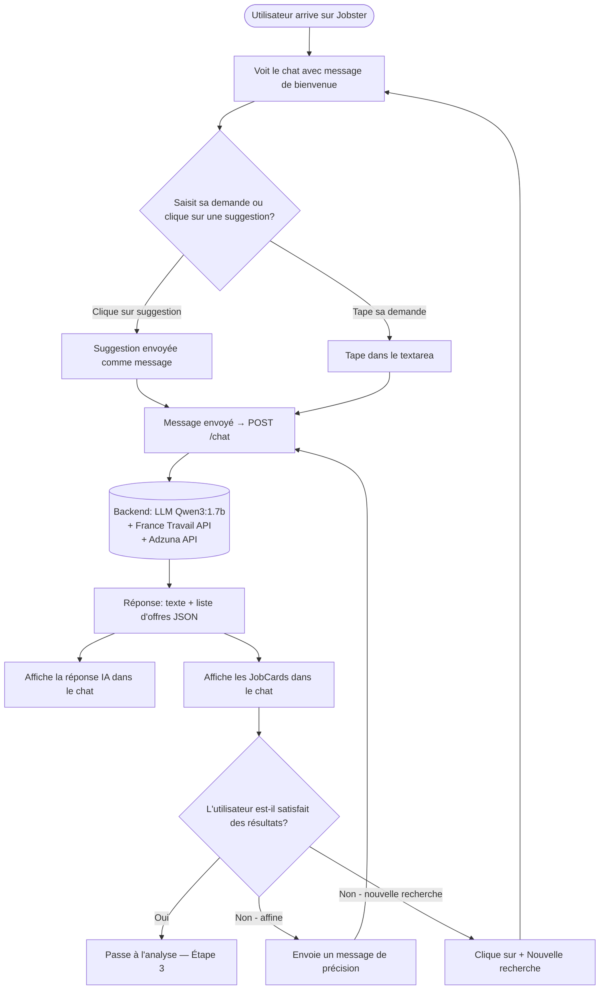
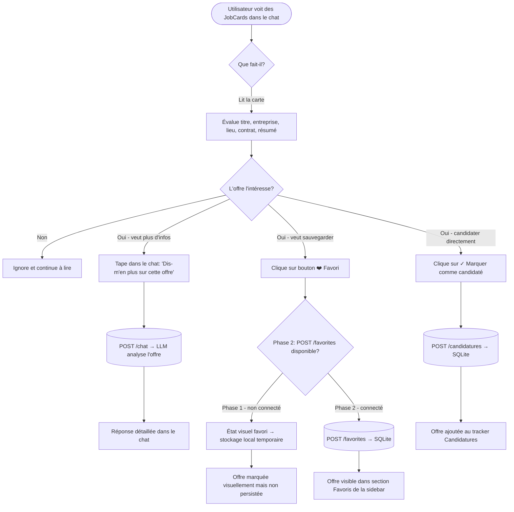
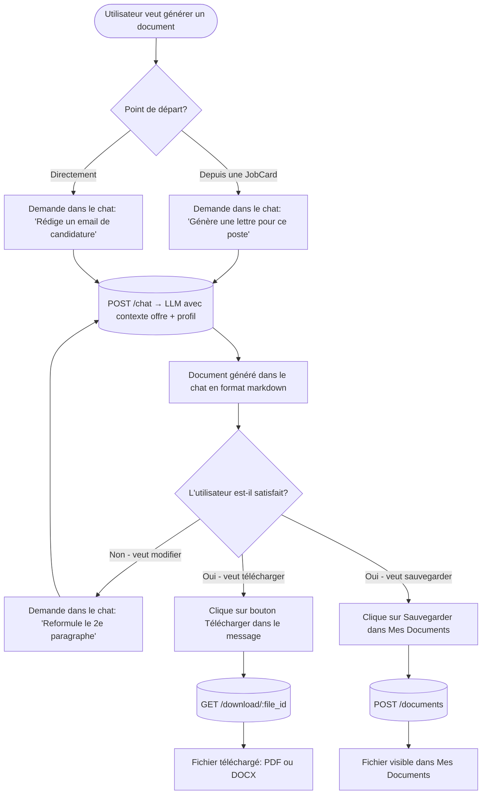
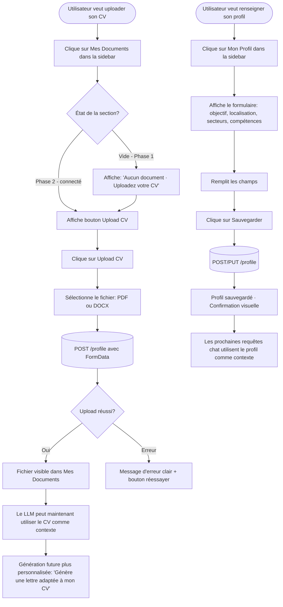
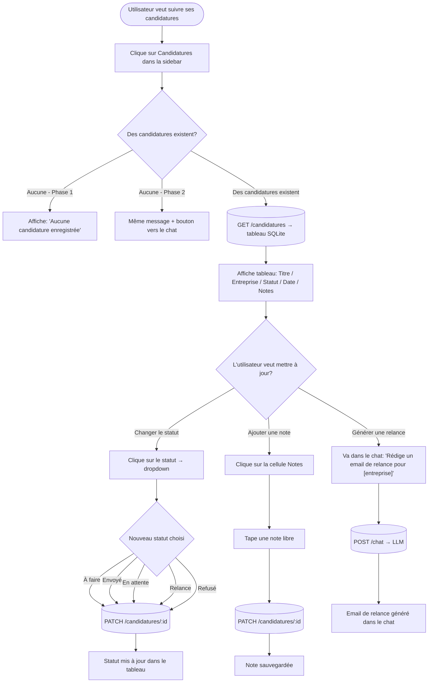
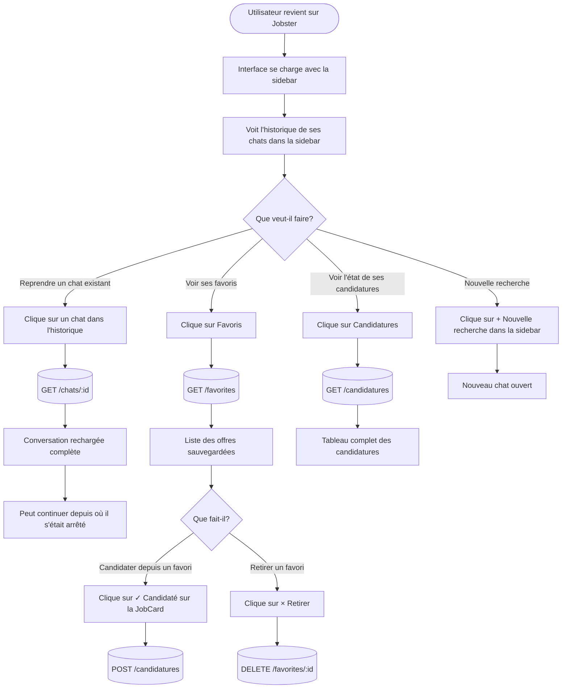
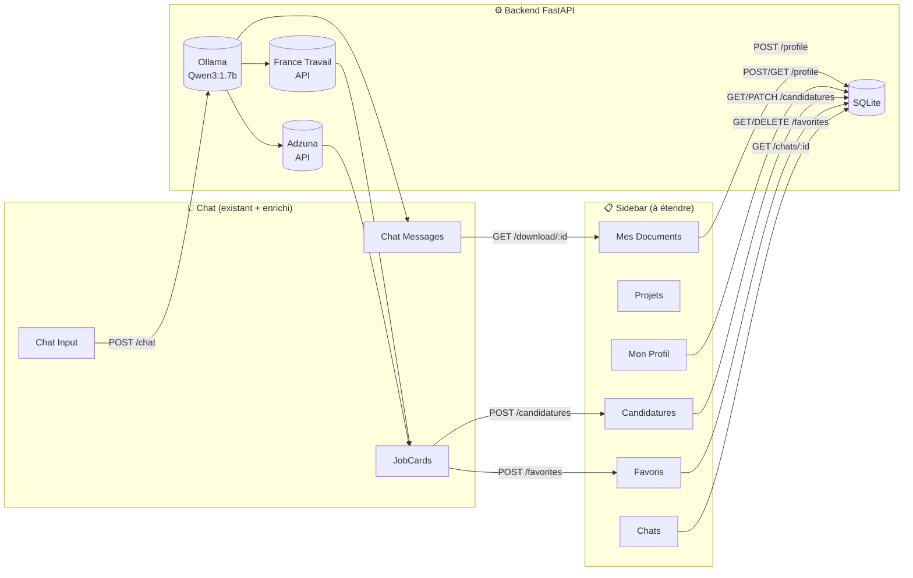

# UX Flow Diagram — Jobster
> Flux d'interaction · Diagrammes Mermaid · 6 cas d'usage principaux

---

## Note de lecture

Ces diagrammes décrivent les flux d'interaction utilisateur → interface → backend pour chaque cas d'usage principal. Ils sont utilisables directement comme référence pour le développement frontend et la coordination backend.

- **Rectangles** → actions utilisateur ou états
- **Losanges** → décisions ou branchements
- **Cylindres** → données / endpoints backend
- **Phase 1** → fonctionne sans backend (UI only) — ✅ Implémenté
- **Phase 2** → nécessite les endpoints backend — ✅ Implémenté
- **Phase 3** → extensions SQLite (favorites, projects) — ⏳ À faire pour Keynote

> **État au 2026-05-25 :** Phase 1 + 2 complètes. Les nœuds "Phase 2 - connecté" dans les diagrammes ci-dessous sont tous actifs. POST /favorites reste localStorage pour l'instant (Phase 3).

---

## Flux 1 — Recherche d'offres (Use Case principal)

---

## Flux 2 — Analyse et sauvegarde d'une offre

---

## Flux 3 — Génération d'un document (lettre, email, présentation)

---

## Flux 4 — Upload de CV et personnalisation du profil

---

## Flux 5 — Suivi des candidatures (Tracker)

---

## Flux 6 — Reprise de session (Continuité entre sessions)

---

## Vue d'ensemble — Flux inter-connectés

---

*Document créé dans le cadre du projet Jobster-hephaestus · Epitech S1 IA BOT*
*Diagrammes compatibles Mermaid — rendus dans GitHub, Notion, et la plupart des éditeurs Markdown*
